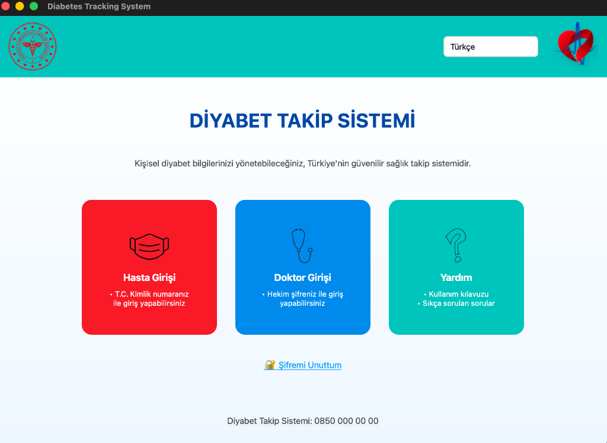
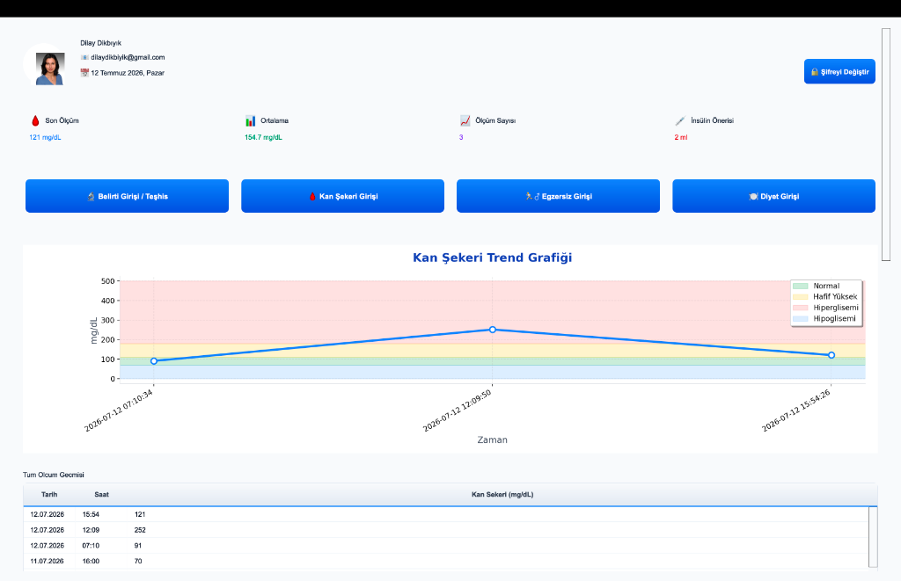
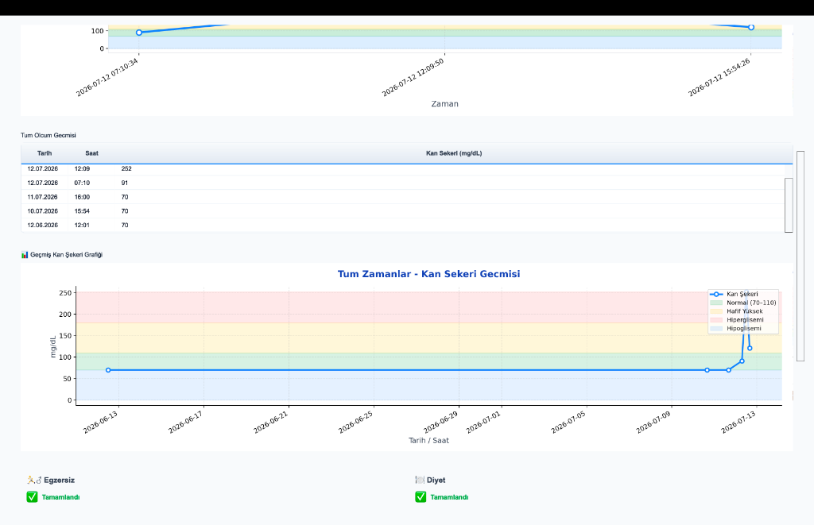
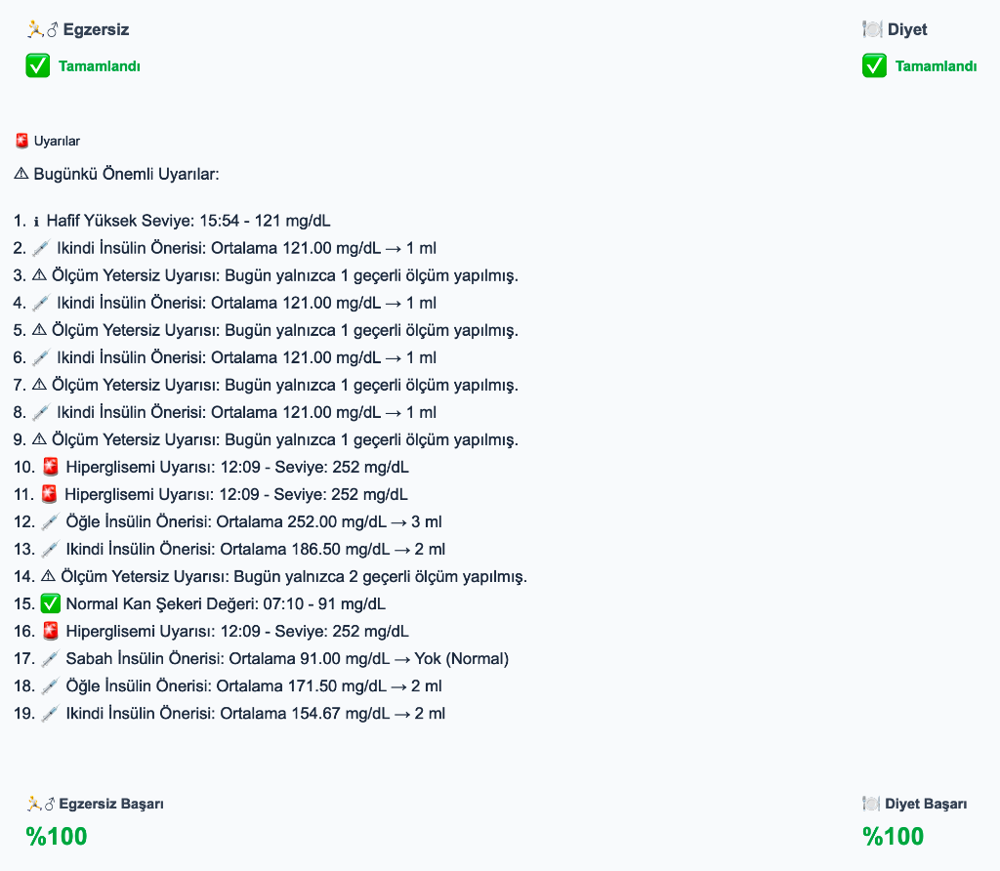
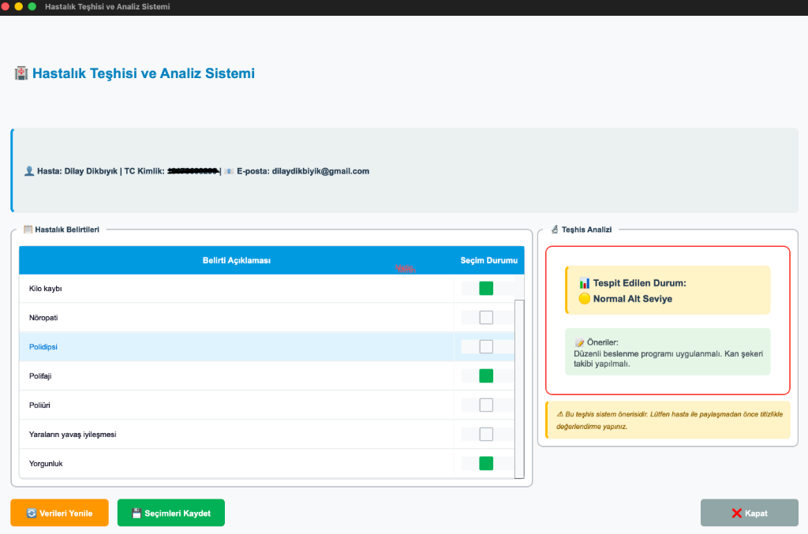
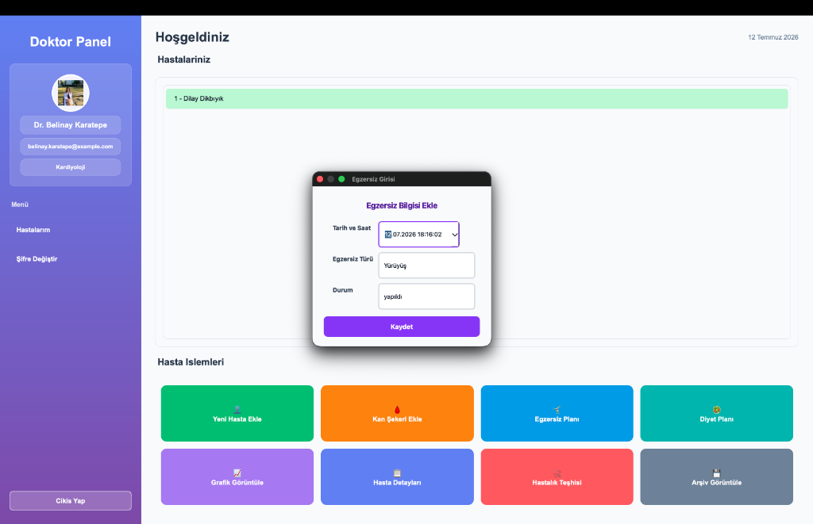
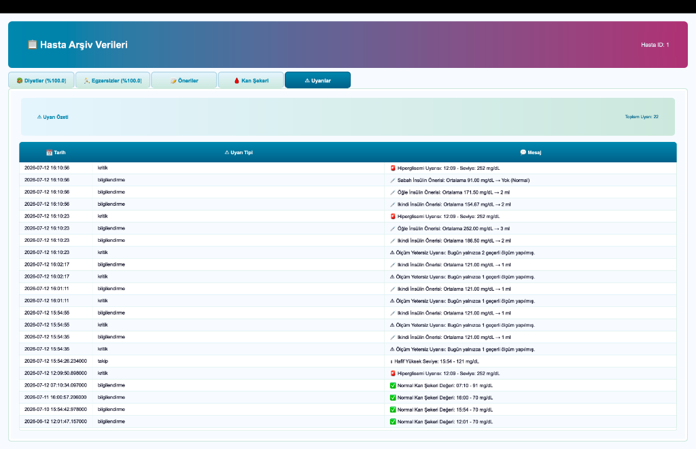
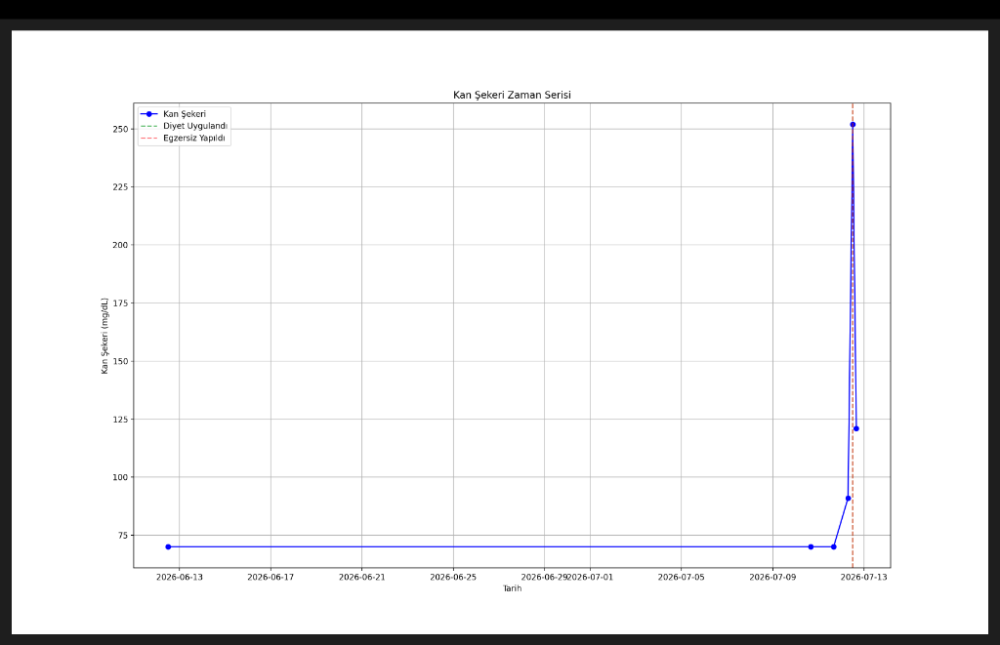

# 🏥 Diabetes Tracking System

A desktop application for tracking and managing diabetes-related health data, built with **Python** and **PyQt5**. Designed for both patients and doctors, providing blood sugar monitoring, dietary tracking, exercise logging, disease diagnosis, and intelligent alerts.

---

## 📸 Screenshots

### 🔑 Login Screen


---

### 👤 Patient Dashboard


---

### 📊 Blood Sugar Chart & History


---

### ⚠️ Daily Alerts & Recommendations


---

### 🩺 Disease Diagnosis System


---

### 👨‍⚕️ Doctor Panel


---

### 📋 Patient Archive (5 Tabs)


---

### 📈 Blood Sugar Time Series (Doctor View)


---

## 🚀 Features

### 👤 Patient
- Blood sugar measurement entry (morning / noon / afternoon / evening / night)
- Historical blood sugar trend chart with color-coded risk zones (normal, slightly high, hyperglycemia, hypoglycemia)
- All-time measurement history table (sorted newest first)
- Insulin dose recommendation based on daily average blood sugar
- Daily diet and exercise tracking with completion percentage
- Smart alerts: hyperglycemia, hypoglycemia, insufficient measurement warnings
- Password change

### 👨‍⚕️ Doctor
- Patient registration with auto-generated credentials sent via email (SMTP)
- Per-patient blood sugar, diet, and exercise data entry
- Blood sugar trend chart visualization (with diet/exercise event markers)
- Disease diagnosis system: symptom checkboxes + AI-assisted severity analysis
- Patient archive with 5 tabbed views: Diet, Exercises, Recommendations, Blood Sugar, Alerts
- Password change

---

## 🏗️ Architecture (MVC)

This project follows the **MVC (Model-View-Controller)** pattern:

```
diabetesTrackingSystem/
│
├── app.py                             # Application entry point
├── requirements.txt
│
├── database/                          # 🗄️  Model — Data Layer
│   ├── __init__.py                    # Re-exports `connect` for convenience
│   ├── connection.py                  # SQLite connection factory
│   ├── init_db.py                     # Schema creation & table initialization
│   ├── seed_data.py                   # Initial test data
│   └── sql/                           # Raw SQL files
│       ├── schema_sqlite.sql          # Current SQLite schema
│       └── schema_postgres_legacy.sql # Legacy PostgreSQL schema (reference only)
│
├── utils/                             # 🛠️  Shared Utilities
│   ├── hashing.py                     # SHA-256 password hashing
│   └── recommendation_engine.py       # Diet & exercise recommendation logic
│
├── views/                             # 🖥️  View — PyQt5 UI Screens
│   ├── main/                          # Authentication & navigation
│   │   ├── main_login.py             # App entry screen (role selection)
│   │   ├── patient_login.py          # Patient login
│   │   ├── doctor_login.py           # Doctor login
│   │   ├── reset_password.py         # Password reset via email
│   │   ├── help_screen.py            # Help & FAQ
│   │   └── search_screen.py          # Global search
│   │
│   ├── doctor/                        # Doctor-facing screens
│   │   ├── doctor_main.py            # Doctor dashboard (sidebar + patient list + action buttons)
│   │   ├── add_patient.py            # Register new patient
│   │   ├── disease_diagnosis.py      # Symptom-based diagnosis & analysis
│   │   └── view_archive.py           # Patient data archive (5 tabs)
│   │
│   ├── patient/                       # Patient-facing screens
│   │   └── patient_main.py           # Patient dashboard
│   │
│   └── shared/                        # Shared dialogs used by both roles
│       ├── add_blood_sugar.py         # Blood sugar entry dialog
│       ├── add_diet.py                # Diet entry dialog
│       ├── add_exercise.py            # Exercise entry dialog
│       ├── blood_sugar_alert.py       # End-of-day alert & recommendation engine
│       └── blood_sugar_chart.py       # Matplotlib chart widget
│
└── assets/                            # Static assets
    └── images/                        # Screenshots & icons
```

---

## ⚙️ Setup & Run

### Requirements

- Python 3.10+
- PyQt5
- matplotlib

```bash
pip install PyQt5 matplotlib
```

### Initialize the database

```bash
python database/init_db.py
```

### (Optional) Seed test data

```bash
python database/seed_data.py
```

### Run the application

```bash
python app.py
```

---

## 🔐 Test Credentials

| Role    | TC No          | Password | Notes |
|---------|----------------|----------|-------|
| Doctor  | `12345678901`  | `12345`  | Dr. Belinay Karatepe — Kardiyoloji |
| Patient | `22222222222`  | `12345`  | Demo test patient |

---

## 🗄️ Database

Uses **SQLite** — no external server or installation required. The database file `diabetes.db` is created automatically when you run `init_db.py`.

The raw schema is available at [`database/sql/schema_sqlite.sql`](database/sql/schema_sqlite.sql).

### Main Tables

| Table | Description |
|-------|-------------|
| `hastalar` | Patients |
| `doktorlar` | Doctors |
| `kan_sekeri` | Blood sugar measurements |
| `diyetler` | Diet records |
| `egzersizler` | Exercise records |
| `belirtiler` | Symptom selections per patient |
| `belirti_tanimlari` | Symptom type definitions |
| `uyarilar` | Auto-generated alerts |
| `diyet_tanimlari` | Diet type definitions |
| `egzersiz_turleri` | Exercise type definitions |
| `egzersiz_durumlari` | Exercise status definitions |

---

## 🔧 Tech Stack

| Technology | Purpose |
|-----------|---------|
| Python 3.10+ | Core language |
| PyQt5 | Desktop UI framework |
| SQLite | Embedded database (no server) |
| matplotlib | Blood sugar charts |
| smtplib | Email delivery for new patient credentials |
| hashlib (SHA-256) | Password hashing |

---

## 👩‍💻 Developer

**Dilay Dikbıyık**
📧 dilaydikbiyik@gmail.com
GitHub: [@dilaydikbiyik](https://github.com/dilaydikbiyik)

---

## 📄 License

This project was developed for educational purposes.
